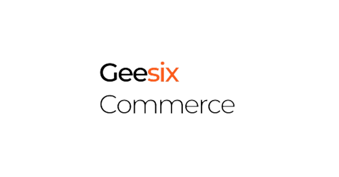

# Geesix Commerce - Capstone Project
Selamat datang di profil GitHub resmi capstone project Geesix Commerce. Ini adalah Capstone Project yang dikembangkan oleh Group 6 Section Semarang sebagai bagian dari program SIB bersama RevoU.

# Our Team
- Ketut Ferio Rizky Ardana - Project Leader & Frontend Engineer (https://github.com/rioardana)
- Suci Siti Zakiyah - Frontend Engineer (https://github.com/sucisitizakiyah)
- Azzahra Putri Maharani - Backend Engineer (https://github.com/AzzahraPutriM)
- Fransiska Liska Bhanda Kiuk - Backend Engineer (https://github.com/Liskakiuk)
- Adimas Raihan Haryobimo - Quality Assurance ()
- Hilda Marsya Dwi Ananda - Quality Assurance ()

# What is Geesix Commerce?

Geesix Commerce adalah sebuah platform e-commerce yang menghubungkan penjual dan pembeli untuk mengubah pengalaman belanja online. Kami adalah inovator di dunia e-commerce yang bertujuan untuk menyediakan tempat yang memungkinkan Anda menjelajahi, berbelanja, dan berjualan produk dengan cara yang lebih nyaman dan menarik.

# Technology used

- [Node.js](https://nodejs.org/)
- [Express.js](https://expressjs.com/)
- [API](https://)
- [Javascript](https://javascript.com/)
- [Sequelize](https://sequelize.org/)
- [Body-parser](https://www.npmjs.com/package/body-parser)
- [Dotenv](https://www.dotenv.org/)
- [EJS (Embedded Javasctipt)](https://ejs.co/)

# Progres Backend Project
Untuk melihat perkembangan bagian Backend Capstone Project di [Tautan ini](https://github.com/Kampus-Merdeka-Software-Engineering/back-end-capstone-project-section-semarang-group-6.git).

# Links
Untuk mengakses situs dapat mengklik tautan dibawah ini:
- Github: https://kampus-merdeka-software-engineering.github.io/FE-Semarang-6/